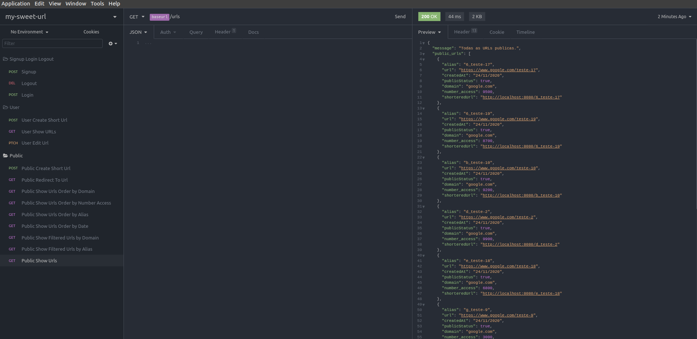
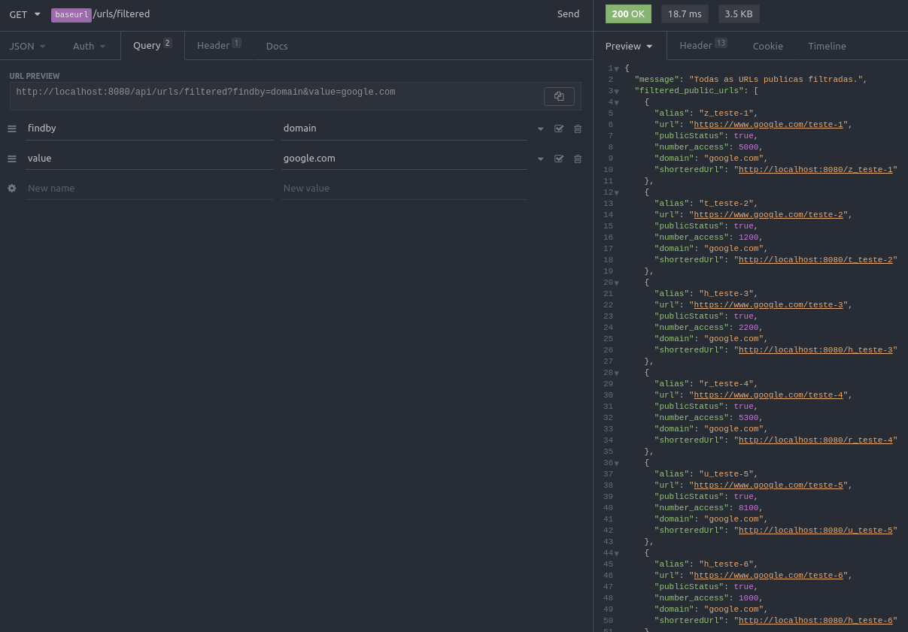

<div align="center">

#  My Sweet URL

## Projeto de uma API Restful para encurtar URL's

</div>

<hr>

### Status do Projeto

🚧 <b>Em construção...</b> 🚧

#### TODO:

**V1**

- [x] Refatorar os códigos de mensagens de API Rate Limiter
- [x] Incluir solução de Cache para redirecionamento de url
- [ ] Atualizar cache para cada alteracao/criação/exclusao de url
- [ ] Finalizar a documentação

**V2**

- [ ] Incluir recuperação de senha
- [ ] Incluir geração de arquivos CSV de urls cadastradas pelos usuários cadastrados
- [ ] Envio de CSV por email do usuário (se possível)
- [ ] **Verificar possibilidade de cadastrar/entrar com Google OAuth**
### Tabela de conteúdos

- [Sobre](#sobre)
  - [API Restful](#api)
  - [Projeto front-end](#frontend)
- [API Rate Limiter](#rate-limiter)
- [Features](#features)
  - [Usuário anônimo](#anonimo)
  - [Usuário cadastrado](#usuario)
  - [Por que me cadastrar na aplicação?](#cadastro)
- [Features em desenvolvimento](#features)
  - [Migrations para auxiliar no desenvolvimento](#migrations)
  - [Testes](#testes)
    - [Manuais](#manuais)
  - [Filtros](#filtros)
- [Endpoints](#endpoints)
- [Como usar localmente](#como-usar)
  - [Requisitos](#como-usar)
    - [Configurando arquivo `.env`](#env)
  - [Nao tenho mongodb instalado. E agora?🤔](#atlas)
    - [Atlas](#atlas)
    - [Container Docker](#docker)
- [Tecnologias/ferramentas usadas](#tecnologias)
- [Autor](#autor)

<div align="justify">

<p id="sobre"></p>

### Sobre :coffee:

<p id="api"></p>

#### Sobre esta API

Este projeto foi feito com objetivo de enriquecer meu portfólio e ampliar meus conhecimentos em NodeJS, desenvolvendo uma aplicação de back-end que consiste de uma API Restful para **encurtar URL's**, onde um usuário, cadastrado ou anônimo, pode informar uma url que ele julgue ser grande demais, ou que ele queira anônimar, e **receberá a sua versão equivalente encurtada**, para ele possa usá-la ou compartilhá-la.

Por exemplo, um usuário anônimo pode informar uma url do tipo:

`https://www.umaurlgrandequalquer.com.br/caminho/de/teste/1`

informar um apelido, por exemplo: `minha-url`, e receber, como retorno, por exemplo, a sua versão equivalente encurtada: `http://localhost:8080/minha-url`. Neste caso o host está como `http://localhost:8080` pois estou adotando como exemplo o servidor local de desenvolvimento da API, rodando em minha máquina com minhas configurações de servidor. Em produção ou em outros ambientes de teste, esse host está sujeito a valores diferentes.

Quando afirmo url equivalente, estou dizendo que o servidor será capaz de capturar o apelido no link `http://localhost:8080/` **`minha-url`**, resolver este apelido e redirecionar para a url de destino, `https://www.umaurlgrandequalquer.com.br/caminho/de/teste/1`.

Os recurso que cada usuário, anônimo ou cadastrado, pode usar, será especificado e explicado a seguir na documentação.

<p id="frontend"></p>

#### Projeto front-end

Após esta API está concluída, vou desenvolver um front-end para implementar as funcionalidades desta API. O projeto front-end será feito em React (NextJS) e, futuramente, pretendo criar um app deste front-end com React Native, quando meus conhecimentos nesta plataforma estiverem mais consolidados. Consulte os repositórios deste perfil para ver se já está disponível o projeto front-end.

<p id="rate-limiter"></p>

### API Rate Limiter ✋

<p id="features"></p>

### Features 📋

Esta aplicação pode ser de duas formas: Usuário anônimo ou usuário cadastrado.

Dependendo da forma que a aplicação será usada, determinado recurso estará ou não disponível.

_Quais recursos estão diponíveis e para quem?_ 🤔

Vamos ver a seguir...

<p id="anonimo"></p>

#### Usuário anônimo

Um usuário que não está cadastrado no sistema (usuário anônimo), ele tem acesso aos seguintes recursos/benefícios:

- [x] Encurtar uma URL, informando um apelido (`alias`) e a `url` a ser encurtada (`www.urlgigante.com.br`).

- [x] Visualizar todas as URLs encurtadas e que estão publicas (`"public_status": true`).

- [x] Limite de 10 caracteres para o apelido informado.

- [x] Tamanho do apelido aleatório gerado pelo sistema é de 7 caracteres.

Exemplo:

Executando o projeto localmente, um usuário anônimo que informar os seguintes parâmetros:

```bash
  {
    "url":"https://www.youtube.com/watch?v=O_Cc-Xzc0zM",
    "alias": "seu-tubo"
  }
```

Receberá o seguinte retorno:

```bash
  {
    "message": "Nova URL adicionada com sucesso.",
    "urlCreated": {
      "alias": "seu-tubo",
      "url": "https://www.youtube.com/watch?v=O_Cc-Xzc0zM",
      "shortenedUrl": "http://localhost:8080/seu-tubo",
      "domain": "youtube.com",
      "public_status": true,
      "createdAt": "24/11/2020"
    }
  }
```

A resposta vem padronizada para usuários anônimos, ou seja, toda e qualquer URL que ele encurtar, terá por padrão o status publico. Qualquer usuário pode visualizar a URL (que for publica), que foi encurtada e o seu apelido.

**O apelido não é obrigatório**, o usuário pode apenas informar a url, o apelido será gerado com nome aleatório pelo serviço do back-end.

<p id="usuario"></p>

#### Usuário cadastrado

Um usuário pode se cadastrar no sistema e ter acesso a alguns recursos a mais que um usuário anônimo. Estes recursos podem ser relevantes ou não dependendo da vontade do usuário.

Ao se cadastrar na aplicação, o usuário autenticado pode, além de acessar todos os recursos para usuários anônimos, ter acesso aos seguintes recursos/benefícios:

- [x] Definir a url encurtada como privada.

- [x] Editar uma url privada que ele criou, alterando seu apelido ou url.

- [x] Excluir uma url privada que ele criou.

- [x] Limite de 14 caracteres para o apelido informado

- [x] Tamanho do apelido aleatório gerado pelo sistema é de 5 caracteres.

Um usuário quando define uma url como privada, esta apenas não será exibida na listagem publica de urls encurtadas, logo nada irá impedir de o usuário compartilhar a sua url encurtada, mas cabe ao usuário garantir o funcionamento da mesma, pois se ele utiliza uma url privada em algum lugar, e por algum motivo ele editou o apelido ou excluiu, esta não irá funcionar corretamente.

<p id="Testes"></p>

### Testes

<p id="manuais"></p>

#### Testes manuais

O projeto possui um arquivo json chamado `Insomnia_API.json` que server para fazer teste manuais das rotas e recursos da aplicação. Usando o aplicativo para testar API's [Insomnia](https://insomnia.rest/download/), você pode importar o arquivo deste projeto e começar a testar.



As chamada para a API estão organizadas por pastas, para facilitar o entendimento do arquivo. As pastas estão divididas de acordo com os recursos que as chamadas solicitão:

- `Signup Login Logout`: é responsável por tratar chamadas para as funcionalidades de autenticação e cadastro de novos usuários;

- `User`: é responsável por tratar chamadas para funcionalidades de usuário cadastrado e autenticado no sistema, como criar urls privadas, editar, excluir, etc...;

- `Public`: é responsável por tratar chamadas para funcionalidades de usuário anônimo, como criar e visualizar urls publicas.

Na pasta `Public`, eu adicionei chamadas personalizadas para testar recursos de paginação, ordenação dos dados retornados pela API, como por exemplo, ordenar por data de criação/apelido/dominio/numero de acessos, além de poder fazer uma busca filtrada, filtrando a busca por dominio, por exemplo.

Veja abaixo um exemplo de filtrar publicamente uma url por dominio, através de uma _query string_:



<p id="endpoints"></p>

### Endpoints

#### Metodos e retornos anônimos

Estes metodos estao relacionados a **usuários anônimos** (sem cadastro no sistema)
onde estes usuarios podem cadastrar uma nova _url_, que por padrao, esta url e publica,
e visualizar todas as url publicas.

**metodo** _/path_

- **GET** _/showurls_

  - Corpo de requisicao: _nenhum_

  - Retorno da requisicao (exemplo):

  ```json
  {
    "message": "Todas as URLs publicas.",
    "public_urls": [
      {
        "alias": "seu-tubo",
        "url": "https://www.youtube.com/"
      }
    ]
  }
  ```

  - message: `string`,

  - public_urls: `array[{}]`

  - alias: `string`

  - url: `string`

<p id="como-usar"></p>

### Como usar localmente? :pushpin:

<p id="requisitos"></p>

#### Requisitos

Para usar localmente em sua máquina, voce deve ter instalado em sua máquina o [NodeJS](https://nodejs.org/en/) com uma versão minima recomendada `v12.0.0`, [MongoDB](https://www.mongodb.com/) e o [Git](https://git-scm.com).
Além disto é bom ter um editor para trabalhar com o código como [VSCode](https://code.visualstudio.com/).
Para começar, faça o clone deste repositório. Digite o comando no terminal:

```bash
$ git clone https://github.com/IglanCardeal/my-sweet-url-api
```

Acesse a pasta do projeto:

```bash
$ cd my-sweet-url-api
```

Instale as dependências do projeto usando o `npm` ou `yarn` se preferir:

```bash
$ npm install
# ou
$ yarn install
```

<p id="env"></p>

Agora precisamos configurar o arquivo `.env`, que contém as variáveis de ambientes essenciais para executar a aplicação. Neste respositório, temos um arquivo de exemplo das variáveis de ambiente chamado `.env,example`. Abra esse arquivo e veremos o seguinte:

```bash
# APP detalhes
APP_NAME= App Envio de Email
APP_AUTHOR= Iglan Cardeal
APP_EMAIL= emailperformanceapp@teste.com

# APP Port
PORT= 3000
HOST= localhost

# Database MongoDB
DB_NAME=app-envio-email
DB_PORT=27017

# Quando NODE_ENV=development
DB_DEV_HOST=127.0.0.1
# Quando NODE_ENV=production
DB_HOST=127.0.0.1
# URL Provedor externo
DB_HOST_EXTERNAL=

```

<p id="env"></p>

Agora, renomeie o arquivo `.env.example` para `.env`.

Feito isso, execute o comando abaixo e o aplicativo será iniciado localmente como ambiente de desenvolvimento em sua máquina:

```bash
$ npm run dev
# ou
$ yarn dev
```

Agora abra seu navegador na URL `http://localhost:3000` e verá a página inicial do projeto.

<p id="atlas"></p>

#### Não tem MongoDB instalado?

Sem problemas!

#### Atlas

Voçê pode inserir uma URI de algum provedor como o [Atlas](https://www.mongodb.com/cloud/atlas/lp/try2?utm_source=google&utm_campaign=gs_americas_brazil_search_brand_atlas_desktop&utm_term=mongodb&utm_medium=cpc_paid_search&utm_ad=e&utm_ad_campaign_id=1718986516). Neste caso, vamos definir um URI no em `DB_HOST_EXTERNAL=`. Esta variável tem prioridade, logo se voçê definiu uma URI, ela será usada, senão deixea vazia.
A URI a ser usada, no caso se voçê usar o Atlas, terá o formato semelhante a seguir:

```bash
DB_HOST_EXTERNAL=mongodb+srv://<username>:<password>@cluster0.zcr3z.mongodb.net/<dbname>?retryWrites=true&w=majority
```

Onde:

- `username`: seu nome de usuário

- `password`: sua senha

- `dbname`: nome da base de dados. Eu recomendo chamar de `email-performance-app`

Tendo Feito todas as configurações, execute `npm run dev` ou `yarn dev` para iniciar a aplicação.

**_OBS_**: ao executar o comando para iniciar a aplicação, será exibido no terminal a URI de conexão com o banco.

<p id="docker"></p>

#### Voçê usa Docker? :whale:

Uma solução alternativa é subir um container do Docker do MongoDB. Existe a [imagem oficial do mongo](https://hub.docker.com/_/mongo) que podemos usar para subir um container mongodb e usar o banco de dados.
Na raíz do projeto temos um arquivo `docker-compose.yml` com as seguintes características:

```bash
version: "3"

services:
  # app:
  #   container_name: my_sweet_url
  #   build: .
  #   ports:
  #     - "3000:3000"
  #   command: yarn dev
  #   # volumes:
  #   #   - ./data:/data/db
  #   links:
  #     - mongo

  mongo:
    container_name: my_sweet_mongo
    image: mongo
    ports:
      - ${DB_PORT}:27017

```

Esse arquivo é a base para gerar um container do mongodb.
Temos também um arquivo `Makefile` para que possamos executar comandos do `docker-compose` de uma maneira mais rápida.
Características do `Makefile`:

```bash
include .env

.PHONY: up

up:
  docker-compose up -d

.PHONY: down

down:
  docker-compose down

.PHONY: logs

logs:
  docker-compose logs -f
```

- `include .env` carrega as variáveis de ambiente do arquivo `.env`.

- `up` executa o `docker-compose` com os containers em background

- `logs` exibe os logs

- `down` desmonta os containers

Para subir o container, digite no terminal `make up`, e aguarde o docker baixar e montar a imagem do mongodb.

Ao finalizar, execute `make logs`, para verificar se tudo ocorreu bem nos logs.

Execute `make down` para desmontar o container.

### Quais tecnologias/ferrramentas foram usadas? :wrench:

<p id="tecnologias"></p>

- [NodeJS](https://nodejs.org/en/)
- [Express](https://expressjs.com/pt-br/) (Framework web)
- [MongoDB](https://www.mongodb.com/)
- [Docker](https://www.docker.com/)
- [Git](https://git-scm.com)
- [VSCode](https://code.visualstudio.com/)

### Autor

<p id="autor"></p>

<kbd>
 
</kbd>

<b>Iglan Cardeal</b>

Desenvolvido e mantido por Iglan Cardeal :hammer: </br>
Desenvolvedor NodeJS 💻 <br>
Entre em contato! 👋🏽

- cmtcardeal@outlook.com :email:
- Instagram [@cmtcardeal](https://www.instagram.com/cmtecardeal/)
- StackOverflow [Cmte Cardeal](https://pt.stackoverflow.com/users/95771/cmte-cardeal?tab=profile)

</div>
